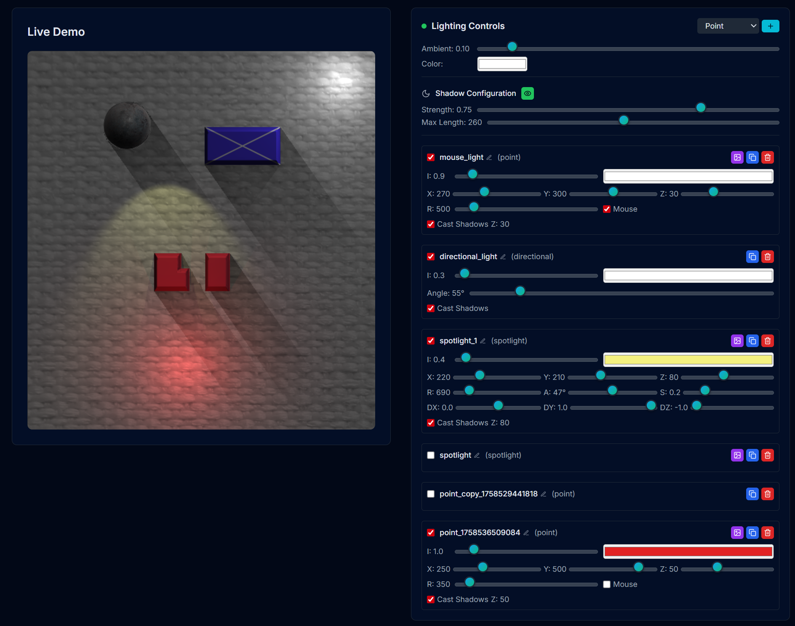

# PIXI.js 2.5D Advanced Light and Shadow System

A comprehensive React.js application showcasing advanced pseudo-3D shadow casting using PIXI.js primitives. Features a complete lighting system with unlimited sprite shadow casters, per-light shadow controls, performance optimization, and external JSON configuration management.

## 🚀 Live Demo

**[Try the Live Demo →](https://pixi-lights-and-shadows.vercel.app/)**

Experience the full lighting and shadow system in action with interactive controls, real-time adjustments, and comprehensive JSON configuration management.



*Live demo showing multiple light types (point, directional, spotlight) with real-time shadow casting, normal mapping, and comprehensive lighting controls.*

## ✨ Key Features

### 🌑 Advanced Shadow Casting System
- **Unlimited Shadow Casters**: Auto-switching architecture supports any number of sprite shadow casters
- **Per-Light Shadow Control**: Individual shadow casting flags for each light source
- **Per-Sprite Shadow Participation**: Granular control over which sprites cast and receive shadows
- **Performance Optimized**: Automatic switching between per-caster uniforms (≤4 casters) and occluder map approach (unlimited)
- **Distance-Based Soft Shadows**: Configurable shadow softness with distance-based edge controls
- **Multiple Shadow Types**: Point light, spotlight, and directional light shadow casting

### 🔦 Unlimited Multi-Light Support
- **Point Lights**: Unlimited omnidirectional lights with multi-pass rendering (4 per pass for optimal performance)
- **Spotlights**: Unlimited directional cone lights with adjustable angle, softness, and falloff (4 per pass)
- **Directional Lights**: Unlimited infinite distant lights (like sunlight) with parallel ray shadow simulation (2 per pass)
- **Ambient Lighting**: Global illumination controls with color tinting
- **Multi-Pass Architecture**: Automatic switching to multi-pass rendering for >8 total enabled lights

### 🎭 Advanced Mask System
- **Texture-Based Light Masking**: Apply custom mask textures to any light for complex lighting patterns
- **Pixel-Perfect Scaling**: Scale 1.0 displays masks at their actual pixel dimensions
- **Real-Time Transforms**: Live adjustment of mask offset, rotation, and scale
- **Shadow-Aware Masking**: Masks only apply in fully lit areas, shadows override masks

### 📄 External JSON Configuration System
- **Scene Configuration**: Complete scene setup via `scene.json` including sprites, positions, textures, and shadow participation
- **Lighting Configuration**: Comprehensive lighting setup via `lights-config.json` with all light properties and shadow settings
- **Auto-Save**: Automatic persistence of lighting configurations every 2-3 seconds
- **Hot-Reload**: Live updates when configuration files change
- **Easy Sharing**: Export and import complete scene and lighting setups

### 🎮 Interactive Controls
- **Real-Time Editing**: All lighting and shadow parameters update instantly
- **Mouse Following**: Lights can track mouse movement for dynamic effects
- **Drag & Drop**: Intuitive positioning of lights in the scene
- **Visual Feedback**: Live preview of all lighting and shadow changes

### 🎨 Modern UI/UX
- **Dark/Light Themes**: Responsive design with theme switching
- **Component Library**: Built with shadcn/ui and Radix UI primitives
- **Accessible Controls**: Keyboard navigation and screen reader support
- **Mobile Responsive**: Works across desktop, tablet, and mobile devices

## 📁 Configuration Files

### Scene Configuration (`client/public/scene.json`)

Defines the complete scene setup including sprites, backgrounds, and shadow participation:

```json
{
  "background": {
    "texture": "textures/background.png",
    "normalMap": "textures/background_normal.png",
    "width": 800,
    "height": 600,
    "zIndex": 0
  },
  "sprites": [
    {
      "id": "ball",
      "texture": "textures/ball.png",
      "normalMap": "textures/ball_normal.png",
      "position": { "x": 120, "y": 80 },
      "width": 75,
      "height": 75,
      "zIndex": 1,
      "castsShadows": true,
      "receivesShadows": true
    },
    {
      "id": "block",
      "texture": "textures/block.png", 
      "normalMap": "textures/block_normal.png",
      "position": { "x": 280, "y": 120 },
      "width": 120,
      "height": 60,
      "zIndex": 1,
      "castsShadows": true,
      "receivesShadows": true
    }
  ]
}
```

**Properties:**
- **id**: Unique identifier for each sprite
- **texture**: Path to diffuse texture (relative to public/)
- **normalMap**: Path to normal map texture for surface detail
- **position**: X,Y coordinates in screen space
- **width/height**: Sprite dimensions in pixels
- **zIndex**: Rendering order (lower values render first)
- **castsShadows**: Whether sprite blocks light and casts shadows
- **receivesShadows**: Whether sprite is affected by shadow calculations

### Lighting Configuration (`client/public/lights-config.json`)

Defines all lighting setup including shadow configuration:

```json
{
  "lights": [
    {
      "id": "mouse_light",
      "type": "point",
      "enabled": true,
      "position": { "x": 270, "y": 300, "z": 130 },
      "color": { "r": 1, "g": 1, "b": 1 },
      "intensity": 1.5,
      "radius": 500,
      "followMouse": true,
      "castsShadows": true,
      "mask": {
        "image": "00035-3934797537.png",
        "offset": { "x": 15, "y": 5 },
        "rotation": 0,
        "scale": 1.4
      }
    },
    {
      "id": "directional_light",
      "type": "directional", 
      "enabled": false,
      "direction": { "x": 0, "y": -1, "z": -1 },
      "color": { "r": 1, "g": 1, "b": 1 },
      "intensity": 0.2,
      "castsShadows": true
    },
    {
      "id": "spotlight_1",
      "type": "spotlight",
      "enabled": false,
      "position": { "x": 220, "y": 210, "z": 80 },
      "direction": { "x": 0, "y": 1, "z": -1 },
      "color": { "r": 0.96, "g": 0.94, "b": 0.50 },
      "intensity": 1.2,
      "radius": 690,
      "coneAngle": 47,
      "softness": 0.2,
      "castsShadows": true
    }
  ],
  "ambientLight": {
    "color": { "r": 0.2, "g": 0.2, "b": 0.3 },
    "intensity": 0.3
  },
  "shadowConfig": {
    "enabled": true,
    "strength": 0.7,
    "maxLength": 200,
    "height": 10
  }
}
```

**Light Properties:**
- **id**: Unique identifier for the light
- **type**: Light type (`point`, `spotlight`, `directional`)
- **enabled**: Whether the light is active
- **position**: 3D position (Z affects shadow projection height)
- **direction**: Light direction vector (spotlight/directional only)
- **color**: RGB color values (0.0 - 1.0)
- **intensity**: Light strength multiplier
- **radius**: Attenuation distance (point/spotlight only)
- **coneAngle**: Spotlight cone angle in degrees
- **softness**: Spotlight edge softness (0.0 - 1.0)
- **followMouse**: Whether light tracks mouse cursor
- **castsShadows**: Whether this light casts shadows

**Mask Properties:**
- **image**: Filename in `/client/public/light_masks/` directory
- **offset**: X,Y position adjustment relative to light
- **rotation**: Rotation angle in degrees
- **scale**: Size multiplier (1.0 = actual pixel size)

**Shadow Configuration:**
- **enabled**: Global shadow system on/off
- **strength**: Shadow opacity (0.0 - 1.0)
- **maxLength**: Maximum shadow length in pixels
- **height**: Shadow casting height (affects projection angle)

## 🚀 Quick Start

### Prerequisites
- Node.js 18+ 
- npm or yarn package manager

### Installation

1. **Start the development server**
   ```bash
   npm run dev
   ```

2. **Open your browser**
   Navigate to `http://localhost:5000` to see the demo

3. **Modify configurations**
   - Edit `client/public/scene.json` to change sprites and scene layout
   - Edit `client/public/lights-config.json` to modify lighting setup
   - Changes automatically reload in the browser

## 🎯 Usage Guide

### Using the JSON Configuration System

#### Scene Setup
1. **Edit `scene.json`**: Modify sprite positions, textures, and shadow participation
2. **Add Textures**: Place diffuse textures in `client/public/textures/`
3. **Add Normal Maps**: Place normal maps with `_normal` suffix for surface detail
4. **Configure Shadows**: Set `castsShadows` and `receivesShadows` per sprite

#### Lighting Setup  
1. **Edit `lights-config.json`**: Configure all lights and shadow settings
2. **Add Masks**: Place mask textures in `client/public/light_masks/`
3. **Live Editing**: Use UI controls to adjust lights (auto-saves to JSON)
4. **Export/Import**: Copy JSON files to share lighting setups

### Interactive Controls

#### Light Management
- **Add Light**: Click "Add Light" button and select type
- **Configure Properties**: Use control panels to adjust all parameters
- **Apply Masks**: Toggle mask system and adjust transforms
- **Shadow Control**: Enable/disable shadow casting per light

#### Shadow System
- **Global Toggle**: Enable/disable entire shadow system
- **Per-Light Control**: Individual shadow casting flags
- **Per-Sprite Control**: Configure which sprites participate in shadows
- **Visual Tuning**: Adjust shadow strength, length, and height

### Light Types Explained

#### Point Lights
- Omnidirectional light emission from a single point
- Realistic distance-based attenuation
- Perfect for light bulbs, candles, or magical orbs
- Cast circular shadows radiating outward

#### Spotlights  
- Directional cone-shaped lighting with adjustable angle
- Smooth edge falloff with configurable softness
- Ideal for flashlights, stage lighting, or focused illumination
- Cast directional shadows following light direction

#### Directional Lights
- Parallel light rays simulating infinite distance sources
- No positional attenuation, uniform intensity
- Perfect for sunlight, moonlight, or environmental lighting
- Cast parallel shadows like real-world sun shadows

## 🏗️ Technical Architecture

### Frontend Stack
- **React 18** with TypeScript for component architecture
- **PIXI.js 7.x** with @pixi/react for WebGL rendering
- **Custom GLSL Shaders** for advanced lighting and shadow calculations
- **Vite** for fast development builds and hot module replacement
- **Tailwind CSS** with shadcn/ui for responsive styling

### Backend Stack
- **Express.js** REST API for configuration persistence
- **Node.js** runtime with TypeScript support
- **In-Memory Storage** with abstract storage interface

### Shadow Casting Pipeline
- **Multi-Pass Rendering**: Separate shadow calculation passes for complex scenes
- **Occluder Map Architecture**: Automatic switching for unlimited shadow casters
- **Unified Shadow Calculation**: Single shader function handles all light types
- **Distance-Based Softening**: Realistic shadow edge behavior
- **Performance Optimized**: Efficient GPU utilization for real-time shadows

### Graphics Pipeline
- **Custom Geometry**: Manual vertex buffer creation for fullscreen quads
- **Advanced Shaders**: Multi-light GLSL with normal mapping and shadow casting
- **Texture Management**: Efficient loading of diffuse, normal, and mask textures
- **Uniform Optimization**: Smart uniform updates minimize GPU state changes

## 📁 Project Structure

```
├── client/                    # Frontend React application
│   ├── src/
│   │   ├── components/        # React components
│   │   │   ├── PixiDemo.tsx   # Main PIXI.js canvas and lighting system
│   │   │   ├── Sprite.tsx     # Individual sprite rendering component
│   │   │   └── DynamicLightControls.tsx # UI controls for lights
│   │   ├── shaders/           # GLSL shader files
│   │   │   ├── vertex.glsl    # Vertex shader for geometry processing
│   │   │   └── fragment.glsl  # Fragment shader with lighting and shadows
│   │   ├── hooks/             # Custom React hooks
│   │   │   └── usePixiGeometry.ts # PIXI geometry creation utilities
│   │   └── lib/               # Utility functions
│   └── public/
│       ├── scene.json         # Scene configuration file
│       ├── lights-config.json # Lighting configuration file
│       ├── textures/          # Diffuse and normal map textures
│       └── light_masks/       # Mask texture library
├── server/                    # Backend Express server
│   ├── routes.ts              # API endpoints for configuration
│   ├── storage.ts             # Data persistence layer
│   └── index.ts               # Server entry point
├── shared/                    # Shared TypeScript types
│   ├── schema.ts              # Database schema definitions
│   └── lights.ts              # Light and shadow configuration types
└── replit.md                  # Project documentation and preferences
```

## 🔧 Shadow System Technical Details

### Architecture Modes

#### Per-Caster Uniforms (≤4 shadow casters)
- Direct uniform passing for each shadow casting sprite
- Optimal performance for smaller scenes
- Lower GPU memory usage
- Simpler shader logic

#### Occluder Map (Unlimited shadow casters)
- Render-to-texture approach for complex scenes
- Supports unlimited number of shadow casters
- Higher GPU memory usage but better scalability
- Advanced shader sampling techniques

### Shadow Calculation Process

1. **Caster Detection**: Identify sprites with `castsShadows: true`
2. **Architecture Selection**: Choose optimal rendering approach
3. **Shadow Ray Casting**: Calculate shadow rays from light to fragment
4. **Occlusion Testing**: Test intersection with shadow casting geometry
5. **Distance Calculation**: Compute shadow factor based on occlusion
6. **Final Compositing**: Blend shadows with lighting calculations

### Performance Optimization

#### Multi-Pass Light Rendering
- **Automatic Switching**: Single-pass for ≤8 lights, multi-pass for unlimited lights
- **Per-Pass Limits**: 4 point lights + 4 spotlights + 2 directional lights per pass
- **Optimal Batching**: Groups lights efficiently to minimize GPU state changes
- **Pass Calculation**: `Math.max(pointPasses, spotPasses, dirPasses)` determines total passes

#### General Optimizations
- **Automatic LOD**: Shadow quality adapts to scene complexity
- **Efficient Culling**: Disabled lights consume no GPU resources
- **Smart Updates**: Only re-render when uniforms change
- **Texture Pooling**: Reuse loaded textures across multiple lights
- **Shader Compilation Caching**: Avoid redundant shader compilation

## 🎨 Shader System

### Fragment Shader Features
- **Multi-Light Processing**: Handles point, spot, and directional lights simultaneously
- **Normal Mapping**: Full surface detail using normal map textures
- **Shadow Integration**: Unified shadow calculation for all light types
- **Mask Sampling**: Advanced texture sampling for shaped lighting effects
- **Distance Attenuation**: Physically-based light falloff calculations

### Uniform Variables
```glsl
// Material properties
uniform sampler2D uDiffuse;        // Base color texture
uniform sampler2D uNormal;         // Normal map for surface detail
uniform vec3 uColor;               // Global color tint

// Shadow system
uniform bool uShadowsEnabled;      // Global shadow toggle
uniform float uShadowStrength;     // Shadow opacity
uniform float uShadowHeight;       // Sprite height for projection
uniform float uShadowMaxLength;    // Maximum shadow distance

// Per-light uniforms (example for point light 0)
uniform bool uPoint0Enabled;       // Light active state
uniform vec3 uPoint0Position;      // 3D world position
uniform vec3 uPoint0Color;         // RGB light color
uniform float uPoint0Intensity;    // Light strength
uniform float uPoint0Radius;       // Attenuation radius
uniform bool uPoint0CastsShadows;  // Shadow casting flag

// Mask system
uniform bool uPoint0HasMask;       // Mask enabled
uniform sampler2D uPoint0Mask;     // Mask texture
uniform vec2 uPoint0MaskOffset;    // Position offset
uniform float uPoint0MaskRotation; // Rotation angle
uniform float uPoint0MaskScale;    // Size multiplier
```

## 🛠️ Development

### Adding New Sprites

1. **Create textures**: Add diffuse and normal map textures to `client/public/textures/`
2. **Update scene.json**: Add sprite configuration with shadow properties
3. **Test shadows**: Verify shadow casting and receiving behavior
4. **Optimize**: Adjust shadow height and participation for best visual results

### Creating Custom Masks

Mask textures should be:
- **High contrast** images with clear light/dark areas
- **Power-of-2 dimensions** (256x256, 512x512, 1024x1024)
- **PNG format** recommended for transparency support
- **Grayscale or color** (red channel used for intensity)

### Extending Light Types

1. **Extend schema** in `shared/lights.ts`
2. **Add shader uniforms** in `fragment.glsl`
3. **Implement lighting math** with shadow integration
4. **Update uniform handling** in `PixiDemo.tsx`
5. **Add UI controls** in `DynamicLightControls.tsx`

### Configuration Management

The system automatically:
- **Loads** configurations on startup
- **Saves** changes every 2-3 seconds during editing
- **Validates** JSON structure and provides error feedback
- **Hot-reloads** when files change externally

## 📄 API Reference

### Configuration Endpoints

#### Load Scene Configuration
```
GET /api/load-scene-config
Returns: Scene configuration JSON
```

#### Load Lighting Configuration  
```
GET /api/load-lights-config
Returns: Lighting configuration JSON with shadows
```

#### Save Lighting Configuration
```
POST /api/save-lights-config
Body: Complete lighting configuration
Returns: Success/error status
```

## 🌟 Performance Guidelines

### Optimal Scene Setup
- **Limit active lights**: 4-6 concurrent lights for best performance
- **Manage shadow casters**: Consider scene complexity vs. visual quality
- **Texture optimization**: Use appropriate texture sizes (512x512 typical)
- **Normal map quality**: Balance detail vs. memory usage

### Shadow Performance
- **≤4 casters**: Optimal performance with per-caster uniforms
- **>4 casters**: Automatic switch to occluder map (higher memory)
- **Disable unused shadows**: Turn off shadow casting for non-essential lights
- **Adjust shadow quality**: Use maxLength to limit shadow calculations

## 🤝 Contributing

1. Fork the repository
2. Create a feature branch (`git checkout -b feature/amazing-feature`)
3. Test with both JSON configuration systems
4. Commit your changes (`git commit -m 'Add amazing feature'`)
5. Push to the branch (`git push origin feature/amazing-feature`)
6. Open a Pull Request

### Development Guidelines

- Follow TypeScript strict mode
- Test shadow system with various sprite configurations
- Validate JSON schema changes
- Ensure cross-browser WebGL compatibility
- Update documentation for configuration changes

## 📄 License

This project is licensed under the MIT License - see the [LICENSE](LICENSE) file for details.

## 🙏 Acknowledgments

- **PIXI.js Team** for the excellent WebGL rendering library
- **shadcn/ui** for beautiful, accessible UI components  
- **Replit** for the development platform and hosting
- **WebGL Community** for advanced graphics programming resources

---

**Built with ❤️ featuring advanced shadow casting, unlimited sprite support, and comprehensive JSON configuration**